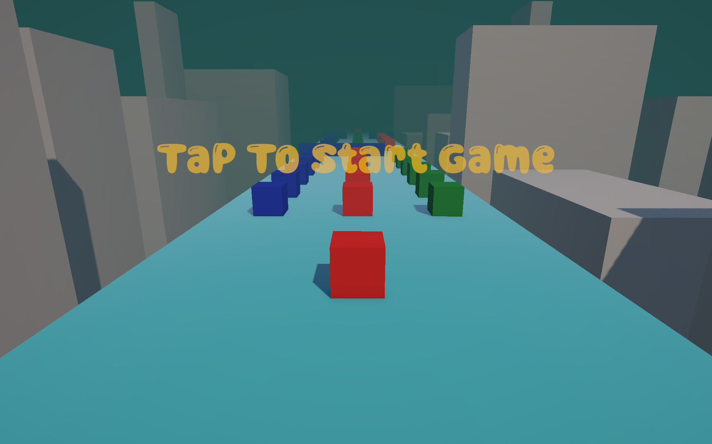
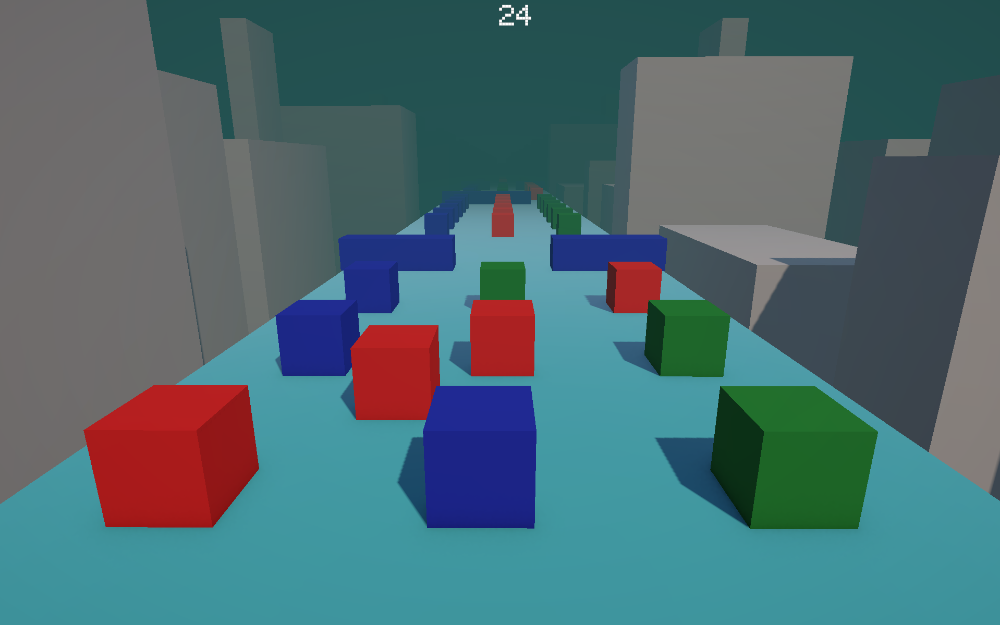
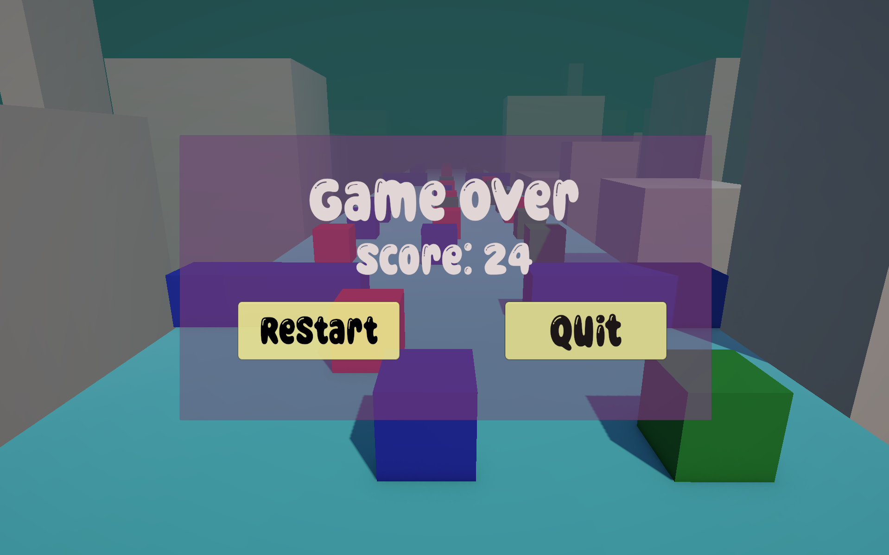

# Cube-Runner-Game

Cube Runner is an endless runner-style game where players control a cube moving forward on a linear path. The main objective is to navigate through an obstacle course filled with various colored cubes by dodging left or right. The game typically features a minimalistic, low-poly aesthetic with simple geometric shapes and vibrant colors.
Players must maneuver through randomly generated cube obstacles by moving left or right.

 
 
 
